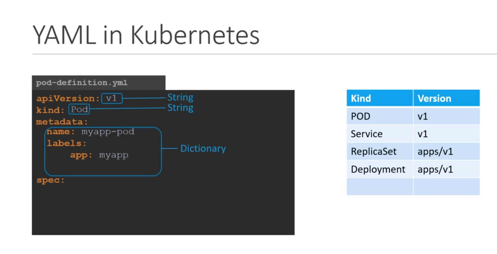
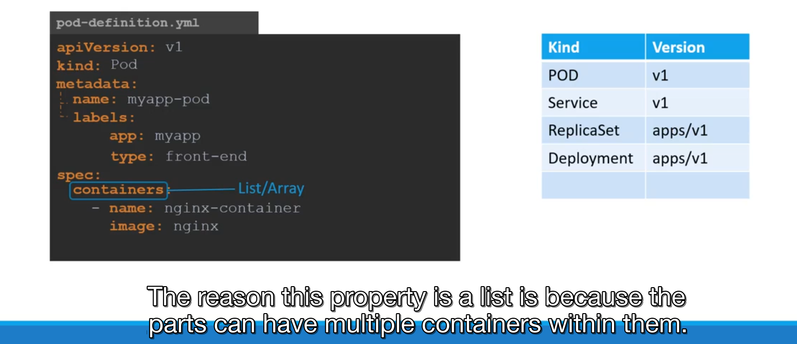
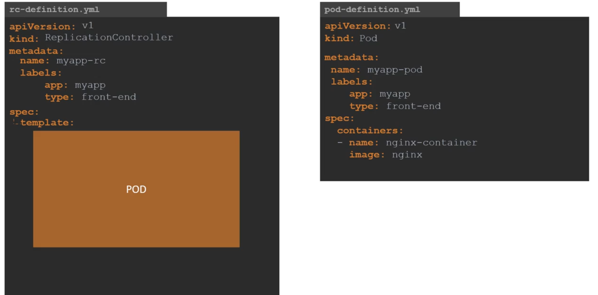
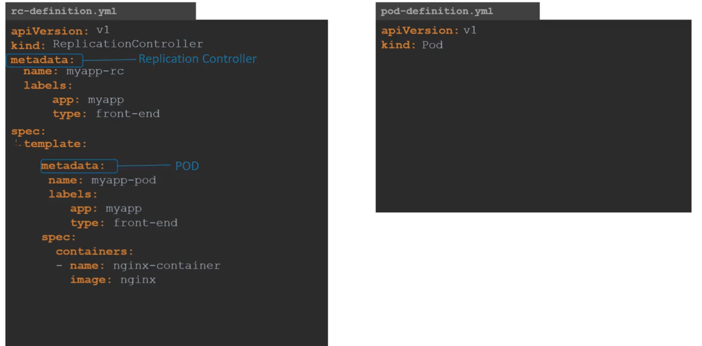
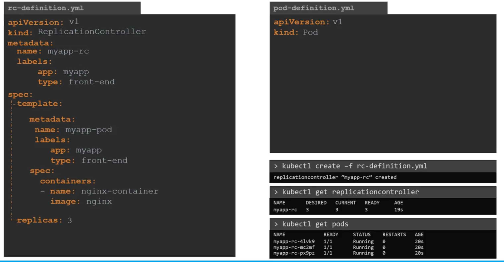
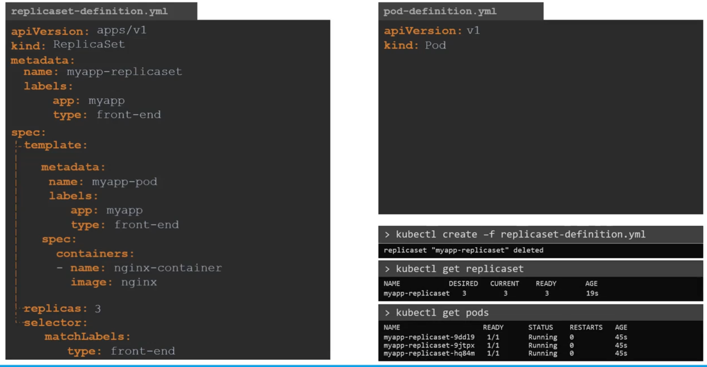
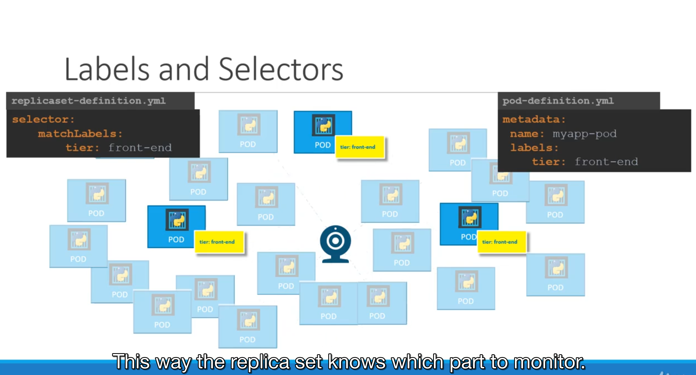
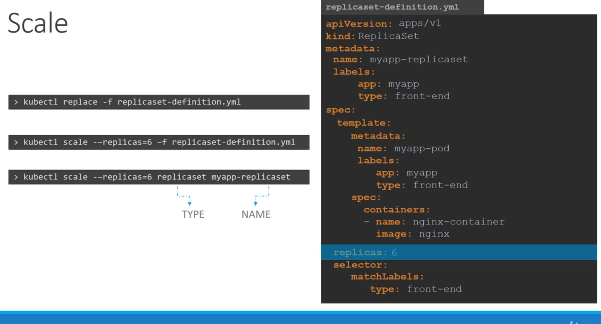
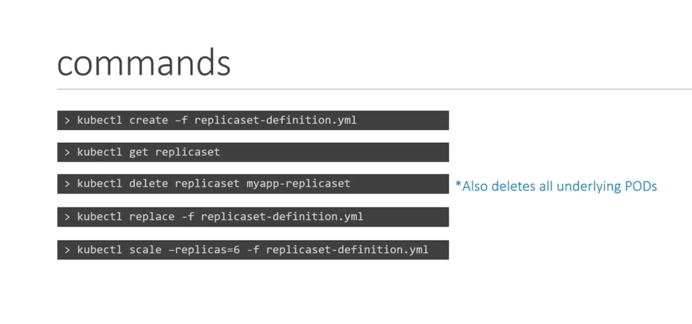

# Deploy a POD and inspect it's infos:


```bash
echo "export KUBECONFIG=/etc/rancher/k3s/k3s.yaml" >> ~/.bashrc
source ~/.bashrc
kubectl get pods
kubectl get pods -all 
kubectl get pods -A 
kubectl get nodes
kubectl run nginx --image nginx 
kubectl get pods 
kubectl cluster-info 
kubectl get pods 
kubectl get nodes 
kubectl describe nodes 
kubectl get pods -o wide 
kubectl get pod -o=custom-columns=NAME:.metadata.name,STATUS:.status.phase,NODE:.spec.nodeName --all-namespaces
kubectl get pods -o wide --all-namespaces --sort-by="{.spec.nodeName}" 
```

# Deploy a Pod using YAML:




```yaml

apiVersion: v1
kind: Pod
metadata:
    name: my-pod-test
    labels:
        app: pod-app
        type: test-pod
spec:
    containers:
    - name: nginx-pod
      image: nginx

```

# ReplicationController:





```yaml
apiVersion: v1
kind: ReplicationController
metadata:
  name: rc-test
  labels:
    app: rc-app
    type: test-rc
spec:
  replicas: 3
  template:
    metadata:
      name: my-pod-test
      labels:
        app: pod-app
        type: test-pod
    spec:
      containers:
      - name: nginx-pod
        image: nginx
```

# ReplicaSet (Labels and Selectors):




## Scale:



## Relevant commands:

